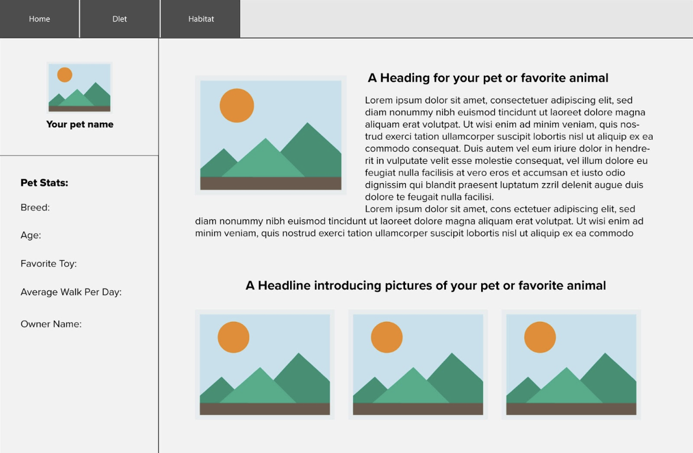

# Peach Parade - Georgia Tech UX/UI Bootcamp In-Class Activity for 16.3

> This single-page website was written for an in-class activity where the class was directed to take a wireframe and recreate it using HTML and CSS.

## The Assignment
Using this wireframe:

Students were instructed to recreate the wireframe in a single-page website using content about their favorite pet, animal, or person. The final project should be done in HTML with CSS styling.

## Files
The `inclass_version` is the version I sent out to the class.

The `video_version` is the version I made in a step-by-step video [located on YouTube](https://youtu.be/QFg6ACH20Wo).

## Video Walkthrough
You can watch a video walkthrough of me coding out this webpage from scratch and explaining my thought process by [clicking this link to the YouTube video](https://youtu.be/QFg6ACH20Wo).

---

Enjoy! If you have any questions, please reachout! Find me on Twitter [@hannahpatellis](https://twitter.com/hannahpatellis) or elsewhere online at [hannahap.com](https://hannahap.com).